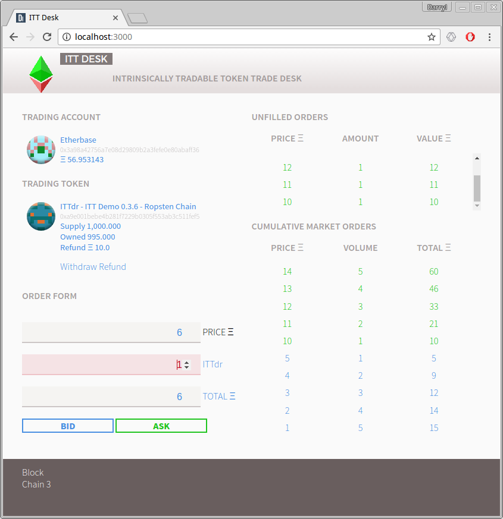

# ITTDesk
GUI Front end for ITT based contracts

Currently in alpha release.

Author is not an experienced web developer so do not consider this app complete, stable or secure.

# Getting Started

Run up an Ethereum client with the rpc cors setting to `http://localhost:3000`:

`parity ui --chain [live | ropsten] --jsonrpc-cors "http://localhost:3000"`

`geth --networkid [1|3] --rpccorsdomain "http://localhost:3000"`

Clone the repo and run with Meteor.

`git clone https://github.com/o0ragman0o/ITTDesk.git`

From the root of the repo:

`meteor`

Open a browser and point it to: 

`"http://localhost:3000"`

# Usage

Most items on the interface are clickable.
Click the account panel to change accounts. Same with the ITT panel.
A **withdraw** button allows a trader to withdraw their accumulated balance of ether (refund) from the ITT contract.
The available trading ether of your account consists of trader account balance plus the refundable ether of that account held on the contract. No explicit *deposit* is required as ether values are calculated at the time of order and where on contract funds are insufficient, additional ether will be sent from the trader account.

Unlike most other exchanges, ITTDesk uses a single orders list with *ask* orders in green and *bid* orders in blue.  Clicking an order in the **Cumulative Market Orders** list will autofill the order form and adjust the *ask/bid/buy/sell* trade buttons according to your account's token and ether balances. The total ether in the order form is taken as the cumulative ether off the order book rather than a simple price * amount calculation of the order form fields.

Clicking an order in the **Unfilled Orders** list will prompt for a **Cancel Order** confirmation.

The Order Form fields will attempt to update according to input. Clicking the amount (token symbol) or *Total* lables will calculate the remaining fields based upon the price field to set up a maximum order (still buggy).

Increaseing and decreseing the Price input will attempt to step in sensible amounts.  Increasing and decreasing the Total input field will attempt to step in minimum denomonations according to `decimalPlaces` from the contract.

# Issues

As stated, this is an alpha release and has multiple problems.  The reactivity can be slow and order form fields clunky. `F5` refresh is your friend if things appear not to be updating.
